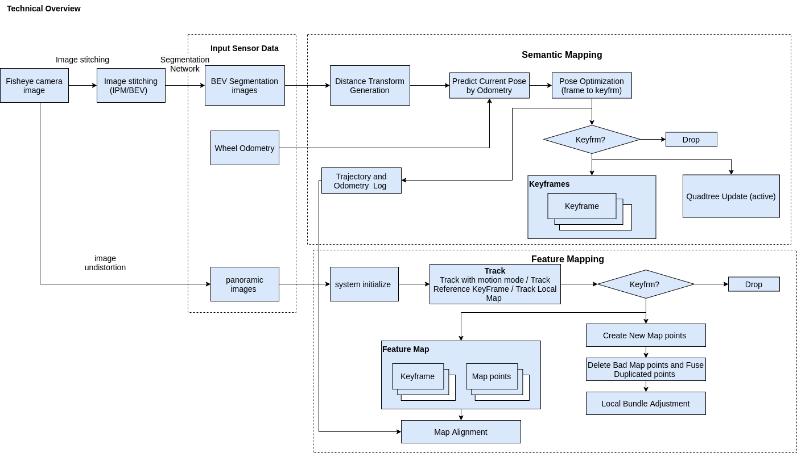
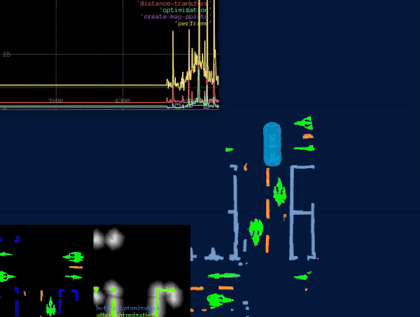
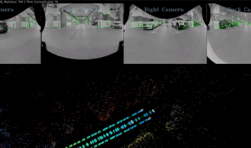
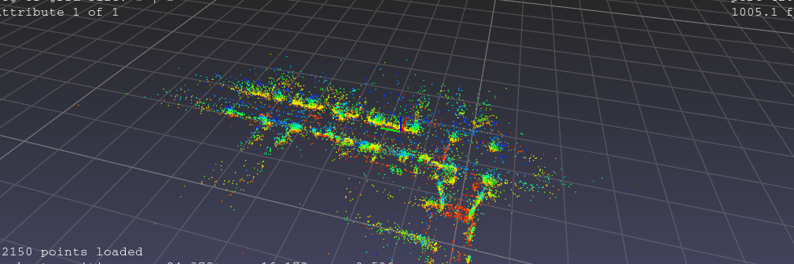
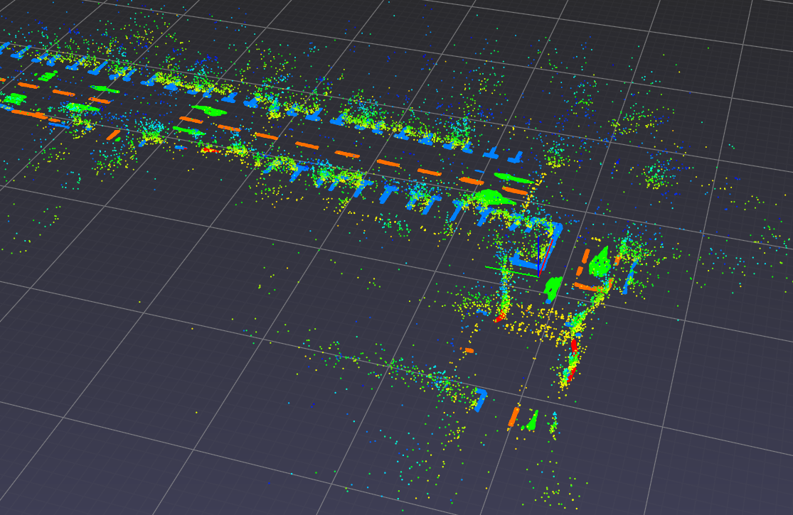
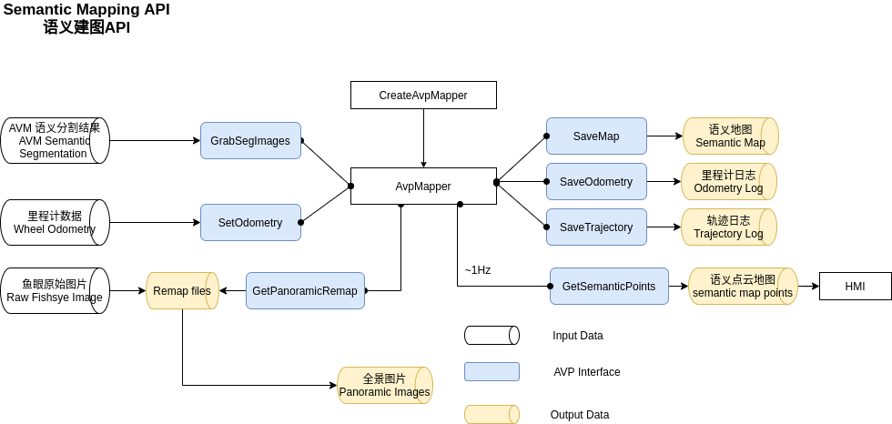
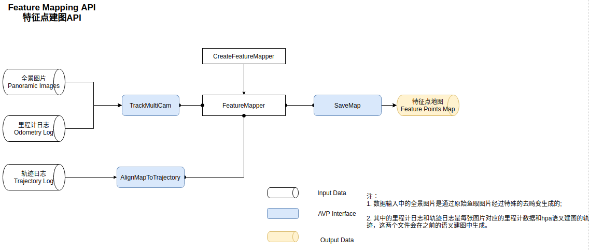
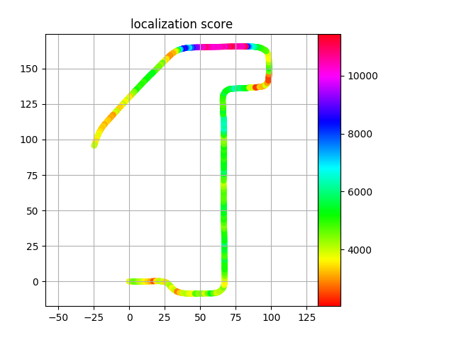

# AVP/HPA Mapping 

---


*Target:  Build a 2D semantic map for localization*

**High level system overview of AVP/HPA Mapping** 




Checkout the technical report in [semantic  mapping technical report](doc/semantic_mapping.md) and [feature mapping  technical report](doc/feature_mapping.md)

## 1. Background 

AVP :  Automated Valet Parking 

HPA : Home zone Parking Assistant 

Autonomous valet parking ( AVP ) is a specific application for autonomous driving, which requires accurate localization.  But for Home zone parking assistant (HPA), online mapping and localization are both essential. As far, we have solved the the problem of localization relative to prior map (map_localization). We will now focus more on how to build a map online. 

The operation principle of home zone parking functions<sub>[1]</sub>: 

1. The driver teaches the system the exact path into the desired parking space once by driving the route manually. With the beginning and the end of the training drive, start and end positions are defined. (Learning)
2. When the vehicle reaches the start position again, both systems maneuver the vehicle conveniently and automatically into the target parking space. (Localization)

## 2. Requirements and Build

#### 2.1 Requirements

1. 3rd-party libraries 

   You can get all other dependent libraries from our vision-3rdparty [repo : https://git.nullmax.net/nullmax-dev/vision-perception/3rdparty.git](https://git.nullmax.net/nullmax-dev/vision-perception/3rdparty.git)

2. Pangolin(optional)

   We use [Pangolin](https://github.com/stevenlovegrove/Pangolin) for visualization and user interface. Download and install instructions can be found at: https://github.com/stevenlovegrove/Pangolin.

####  2.2 Build avp_mapping Library and examples 

* git clone  `3rdparty` 

  Download `3rdparty` repo in the same level directory of the project 

  ```
  cd ..
  git clone https://git.nullmax.net/nullmax-dev/vision-perception/3rdparty.git
  ```

  The directory structure is as follows

  ```
  ├── 3rdparty
  └── map_localization
  ```

* run build script 

  ```
  ./build_x86.sh ## for x86
  or 
  ./build_px2.sh ## for px2 
  or 
  ./build_agx.sh ## for agx
  or
  ./build_qnx.sh ## for qnx
  ```

* viewer (optional, Pangolin required )

  if you want to run demo with visualization, set the CMake cache variable `ENABLE_VIEWER` `ON`  with `ccmake`.

## 3. Demo 

### 3.1 Dataset 

Download test dataset from https://seafile.nullmax.net/library/9010ae29-a646-409d-a711-cf61b7ac0dee/AVP%20Localization%20Dataset/

Change the dataset path in `config/??`. And run the semantic feature mapping demo by executing the following command 

```
./test_hpa_mapping  config_file 
```



or feature mapping

```
./nm_feature_mapping_demo  config 
```




## 4. Tool 

### 4.1 Map visualization 

There are several scripts in `script` folder. You can use these scripts to visualize the the map. There are two types of map: `semantic map`, which is generated by `test_hpa_mapping`, and `feature map`, which is generated by `nm_feature_mapping_demo`. 

For `sematic map`, run the following command: 

```
python show_semantic_map -m map.bin.vis 
```


For `feature map`, run the following command: 

```
python show_feature_map.py -m map_multicam.bin
```



Or you can visualize both map together with the following command:

```
python3.5 show_all_map -m map.bin.vis -f map_multicam.bin
```



### 4.1 Run feature localization 

You can also re-localize image sequence in pre-build map (which is generated by `nm_feature_mapping_demo`).

```
./localization config_file map_multicam.bin  /path/to/image/sequnce/   start_index
```


## 5. System API 

All the APIs of the mapping system are stored in the  `avp_mapping/include/interface/` . There are 2 interface files : 

* avp_mapping_interface.h 
* vslam_types.h 

建图的流程主要分为2部分: 

1. semantic mapping 
2.  feature point mapping

首先进行的是`semantic mapping` 这部分是通过车辆的AVM segmentation的结果**实时**创建语义地图，同时保留全景图像用做后续的`feature point mapping`．当`semantic mapping` 结束后再进行`feature point mapping` 而这部分并不是实时的，因此其使用的上一步保留的图片用于特征地图的构建．





## 6. System Pseudo Code 

### 6.1 Semantic Mapping 

```
 avp_mapper = CreateAvpMapper(config_file)
 remaps = avp_mapper->GetPanoramicRemap()
 ...
 ...
 
 ### new image arrived ### 
 	avp_mapper->GrabSegImages(timestamp, seg_imgs)
 	if(avp_mapper->RemapImageRequired())
 	{
 	  pano_images = remap(raw_fisheye_images , remaps)
      save_images(pano_images) 	
 	}
    
 ### new odometry data arrived #####
     avp_mapper->SetOdometry(timestamp,odom_data) 
     
     
 #### every 10 ~ 20 frames ####  
     semantic_points = avp_mapper->GetSemanticPoints();
     pb_sent_semantic_points( semantic_points)   // for hmi visualization 
     
 
### End of Mapping #### 
    avp_mapper->SaveMap(...)
    avp_mapper->SaveTrajectory(...)   ## save trajectory log
 
```

### 6.2 Feature Mapping 

```
feature_mapper = CreateFeatureMapper(...)

while(剩余图片>0)
   feature_mappe->TrackMultiCam(
         img_left[i],img_front[i],img_right[i],img_back[i],odom_log[i])

end while 

feature_mapper->AlignMapToTrajectory（trajectory_log)
feature_mapper->SaveMap(...)
```


## 7. Localization Score 

It's Important to evaluate the map quality  for localization. Here we simply use  number of points with large value quota.

d

## Reference 

[1] Bosch Home Zone Parking Functions : https://www.bosch-mobility-solutions.com/en/products-and-services/passenger-cars-and-light-commercial-vehicles/automated-parking/home-zone-parking-functions/

[2] Qin T, Chen T, Chen Y, et al. AVP-SLAM: Semantic Visual Mapping and Localization for Autonomous Vehicles in the Parking Lot[J]. arXiv preprint arXiv:2007.01813, 2020.

[3] Hu J, Yang M, Xu H, et al. Mapping and Localization using Semantic Road Marking with Centimeter-level Accuracy in Indoor Parking Lots[C]//2019 IEEE Intelligent Transportation Systems Conference (ITSC). IEEE, 2019: 4068-4073.

[4] Jeong J, Cho Y, Kim A. Road-SLAM: Road marking based SLAM with lane-level accuracy[C]//2017 IEEE Intelligent Vehicles Symposium (IV). IEEE, 2017: 1736-1473.