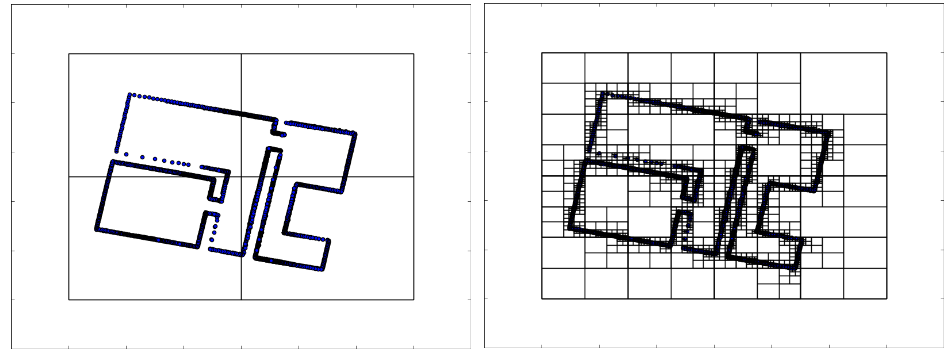
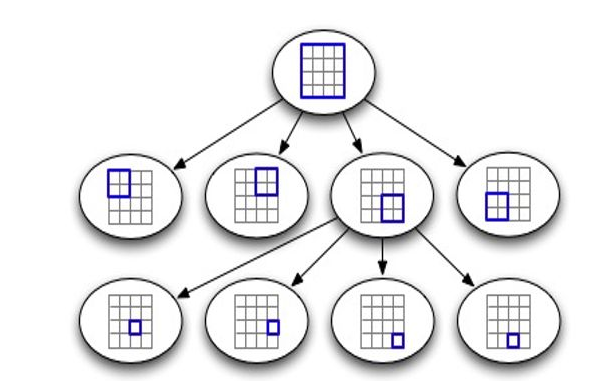
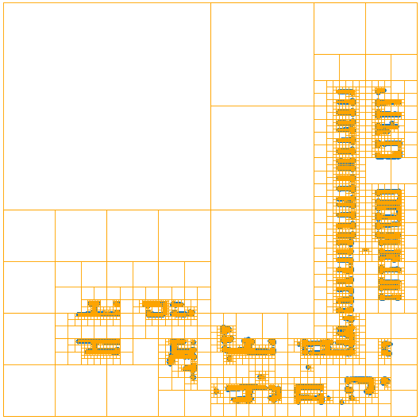

# Quadtree 

## Introduction 

A quadtree is a **tree data structure** in which each internal node has exactly four children. Quadtree are the two-dimensional analog of octrees and are most often used to partition a two-dimensional space by recursively subdividing it into four quadrants or regions. 

*fig quadtree application in 2d  lidar map* 

**Advantages ** :  versatility, good performance for insertion, removal and lookup. And it is easy to understand and implement.

**Why AVP need quadtree map ?**

  

## Reference  

[1] Quick Tip: Use Quadtrees to Detect Likely Collisions in 2D Space [link](https://gamedevelopment.tutsplus.com/tutorials/quick-tip-use-quadtrees-to-detect-likely-collisions-in-2d-space--gamedev-374)

[2] An Interactive Explanation of Quadtree [link](https://jimkang.com/quadtreevis/)